<p align="center">
  <a href="https://uplc.wtf">
    
  </a>
</p>

<p align="center">
  <a href="https://uplc.wtf"><strong>uplc.wtf</strong></a> · Reverse-engineer Cardano Plutus smart contracts from on-chain bytecode
</p>

## What It Does

Paste a Cardano script hash or CBOR hex → get readable Aiken code.

**Example output:**

```aiken
use aiken/list

type Datum {
  owner: ByteArray,
  deadline: Int,
}

type Action {
  Cancel
  Update
  Claim
}

validator decompiled_validator {
  spend(datum: Option<Datum>, redeemer: Action, own_ref: OutputReference, tx: Transaction) {
    when redeemer is {
      Cancel -> ...
      Update -> ...
      Claim -> ...
    }
  }
}
```

The generated code is valid Aiken syntax — paste it into any Aiken project with stdlib.

## Architecture

```mermaid
flowchart TD
    subgraph Input
        A[Script Hash] --> B[Koios API]
        C[CBOR Hex] --> D
    end

    B --> D[CBOR Bytes]
    
    subgraph Decoding
        D --> E["CBOR Decode<br/>(59XXXX header)"]
        E --> F["Flat Decode<br/>(@harmoniclabs/uplc)"]
        F --> G[UPLC AST]
    end

    subgraph Analysis["@uplc/parser + @uplc/patterns"]
        G --> H[Parse UPLC Text]
        H --> I[Detect Script Purpose]
        I --> J[Extract Datum Fields]
        J --> K[Find Redeemer Variants]
        K --> L[Identify Validation Checks]
    end

    subgraph Codegen["@uplc/codegen"]
        L --> M[Generate Types]
        M --> N[Map Builtins → Stdlib]
        N --> O[Emit Aiken Code]
    end

    O --> P[Aiken Output]

    style Input fill:#1a1a2e
    style Decoding fill:#16213e
    style Analysis fill:#0f3460
    style Codegen fill:#533483
```



## Packages

Three npm packages for programmatic use:

| Package | Description |
|---------|-------------|
| `@uplc/parser` | UPLC text → AST with Plutus V3 support (case/constr) |
| `@uplc/patterns` | AST → Contract structure (purpose, datum, redeemer, checks) |
| `@uplc/codegen` | Structure → Aiken code with proper imports and types |

### Supported Script Purposes (Plutus V3)

| Purpose | Description |
|---------|-------------|
| `spend` | UTxO spending validator |
| `mint` | Minting/burning policy |
| `withdraw` | Staking reward withdrawal |
| `publish` | Certificate publishing (DRep, stake pool) |
| `vote` | Governance voting (CIP-1694) |
| `propose` | Governance proposals (CIP-1694) |

## Development

```bash
pnpm install
pnpm dev          # localhost:4321
pnpm build        # production build
pnpm test         # run all tests
```

### Project Structure

```
packages/
  parser/      # UPLC text parser
  patterns/    # Contract pattern recognition  
  codegen/     # Aiken code generation + stdlib mapping
src/
  lib/         # Decompiler helper, frontend utils
  components/  # React components
```

### Testing

```bash
# Run all package tests
pnpm test

# Individual packages
cd packages/parser && pnpm test
cd packages/patterns && pnpm test
cd packages/codegen && pnpm test
```

## How It Works

1. **Decode** — CBOR wrapper → Flat encoding → UPLC AST
2. **Analyze** — Detect purpose, extract datum/redeemer structure, find checks
3. **Generate** — Emit valid Aiken with types, imports, and idiomatic syntax

The decompilation is **deterministic** — no AI hallucination, just static analysis.

## License

MIT

---

<sub>Free to use. [Sponsors welcome](https://github.com/sponsors/will-break-it).</sub>
