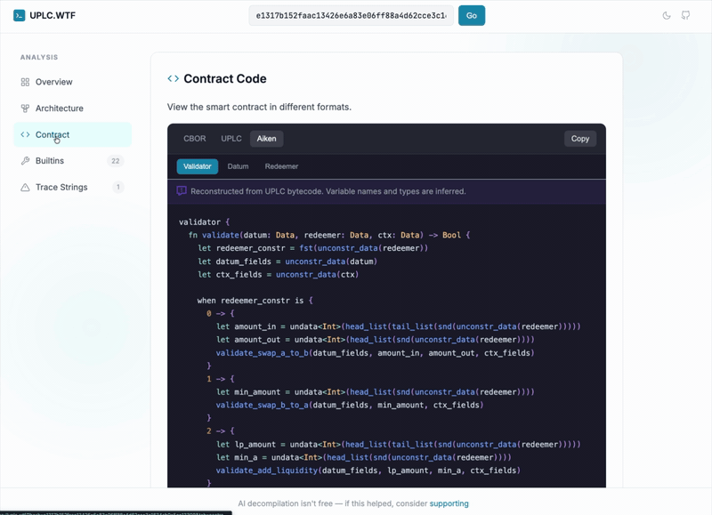

<p align="center">
  <a href="https://uplc.wtf">
    
  </a>
</p>

<p align="center">
  <a href="https://uplc.wtf"><strong>uplc.wtf</strong></a> · Reverse-engineer Cardano Plutus smart contracts from on-chain bytecode
</p>

## How It Works

Cardano smart contracts are stored on-chain as nested binary encodings. This tool decodes them through a deterministic pipeline:

```
On-chain script bytes
    │
    ▼
┌─────────────────────────────────┐
│  CBOR wrapper (59XXXX header)   │  ← Binary serialization format
└─────────────────────────────────┘
    │
    ▼
┌─────────────────────────────────┐
│  Flat-encoded UPLC program      │  ← Compact bit-level encoding
└─────────────────────────────────┘
    │  @harmoniclabs/uplc
    ▼
┌─────────────────────────────────┐
│  UPLC AST                       │  ← Lambda calculus: Lambda, App,
│  (Untyped Plutus Core)          │    Force, Delay, Builtin, Const
└─────────────────────────────────┘
    │  @uplc/parser
    ▼
┌─────────────────────────────────┐
│  Parsed AST                     │  ← TypeScript representation
│                                 │    with Plutus V3 support
└─────────────────────────────────┘
    │  @uplc/patterns
    ▼
┌─────────────────────────────────┐
│  Contract Structure             │  ← Script purpose detection
│                                 │    (spend/mint/withdraw/vote/...)
│                                 │    Redeemer variant analysis
│                                 │    Validation check identification
└─────────────────────────────────┘
    │  @uplc/codegen
    ▼
┌─────────────────────────────────┐
│  Aiken-style pseudocode         │  ← Deterministic decompilation
│                                 │    with readable expressions
└─────────────────────────────────┘
```

**The three views in the tool:**
- **CBOR:** Raw hex bytes as stored on-chain
- **UPLC:** Decoded lambda calculus (parsed from flat encoding)
- **Aiken:** Decompiled pseudocode with Plutus V3 support

### Packages

This project includes three npm packages for programmatic use:

| Package | Description |
|---------|-------------|
| `@uplc/parser` | UPLC text → AST (supports Plutus V3 case/constr) |
| `@uplc/patterns` | AST → Contract structure (purpose, redeemer variants, checks) |
| `@uplc/codegen` | Structure → Aiken-style code |

### Supported Script Purposes (Plutus V3)

- `spend` — UTxO spending validator
- `mint` — Minting/burning policy  
- `withdraw` — Staking reward withdrawal
- `publish` — Certificate publishing
- `vote` — Governance voting (CIP-1694)
- `propose` — Governance proposals (CIP-1694)

<p align="center">
  
</p>

## Development

```bash
npm install
npm run dev     # localhost:4321
npm run build   # production build
npm test        # run all tests
```

### Project Structure

```
packages/
  parser/     # UPLC text parser
  patterns/   # Contract pattern recognition
  codegen/    # Aiken code generation
src/
  lib/        # Frontend utilities
  components/ # React components
test/
  fixtures/   # Test contracts (Aiken-compiled)
```

## License

MIT

---

<sub>Free to use. [Sponsors help keep it available](https://github.com/sponsors/will-break-it).</sub>
