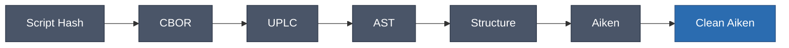

<p align="center">
  <a href="https://uplc.wtf">
    
  </a>
</p>

<p align="center">
  <strong><a href="https://uplc.wtf">uplc.wtf</a></strong> — Reverse-engineer Cardano smart contracts from on-chain bytecode
</p>

## How It Works



| Step | Input | Output | How |
|------|-------|--------|-----|
| Fetch | Script Hash | CBOR | Koios API |
| Decode | CBOR | UPLC | `@harmoniclabs/uplc` |
| Parse | UPLC text | AST | [`@uplc/parser`](packages/parser) |
| Analyze | AST | Structure | [`@uplc/patterns`](packages/patterns) |
| Generate | Structure | Aiken | [`@uplc/codegen`](packages/codegen) |
| Enhance | Aiken | Clean Aiken | LLM |

## Packages

| Package | Purpose |
|---------|---------|
| [`@uplc/parser`](packages/parser) | UPLC text → AST (Plutus V1-V3) |
| [`@uplc/patterns`](packages/patterns) | AST → Contract structure |
| [`@uplc/codegen`](packages/codegen) | Structure → Aiken code |

## Development

```bash
pnpm install
pnpm dev      # localhost:4321
pnpm build    # production
pnpm test     # all tests
```

## Project Structure

```
src/
  components/   # React UI
  lib/          # Frontend decompiler wrapper
packages/
  parser/       # UPLC parser
  patterns/     # Pattern recognition
  codegen/      # Code generation
functions/
  api/          # Cloudflare Functions
    analyze.ts  # Full analysis endpoint (cached)
    enhance.ts  # AI enhancement (rewrite, diagram)
    koios.ts    # Blockchain data proxy
```

## API Endpoints

### `GET /api/analyze?hash={scriptHash}`

Returns full analysis: CBOR, UPLC, Aiken code, builtins, stats.  
Cached permanently (scripts are immutable).

### `POST /api/enhance`

AI-powered enhancements:
- `rewrite`: Transform machine code into human-readable Aiken
- `diagram`: Generate Mermaid architecture diagram

## Why AI Rewrite?

Raw decompilation produces valid but unreadable code—nested lambdas, single-letter variables, no types. The AI rewrite transforms this into code that looks hand-written: proper names, flattened structures, inferred types, idiomatic patterns.

**Before** (deterministic decompilation):
```
fn(a) { fn(b) { fn(c) { g(o(c), delay { True }, delay { False }) }}}
```

**After** (AI rewrite):
```aiken
validator {
  spend(datum: Option<PoolDatum>, redeemer: SwapAction, own_ref: OutputReference, tx: Transaction) {
    when redeemer is {
      Swap { amount_in, min_out } -> validate_swap(datum, amount_in, min_out, tx)
      AddLiquidity { ... } -> ...
    }
  }
}
```

## License

MIT — [Sponsors welcome](https://github.com/sponsors/will-break-it)
