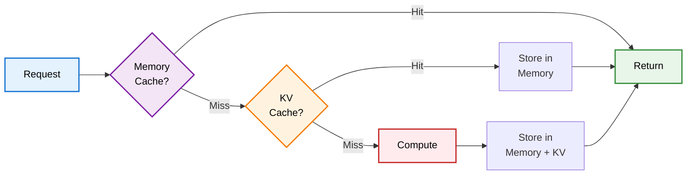

# @uplc/cache

LRU memory cache + Cloudflare KV caching layer.

## What It Does

Provides a two-tier caching system for UPLC decompilation results:
1. **Memory (LRU)**: Fast in-memory cache for frequently accessed scripts
2. **Cloudflare KV**: Persistent distributed cache across serverless function invocations

## Architecture



## Input/Output

- **Input**: Script hash (string)
- **Output**: Cached data (AST, pattern analysis, or unified result)

## Usage

```typescript
import { getGlobalCache } from '@uplc/cache';

// In Cloudflare Worker/Pages Function
export const onRequest = async (context) => {
  const cache = getGlobalCache(context.env.UPLC_CACHE);

  // Try to get from cache
  const cached = await cache.getUnified(scriptHash);
  if (cached) {
    return new Response(JSON.stringify(cached));
  }

  // Compute result
  const result = await computeExpensiveAnalysis(scriptHash);

  // Store in cache
  await cache.setUnified(result);

  return new Response(JSON.stringify(result));
};
```

## API Reference

### `getGlobalCache(kvNamespace?: KVNamespace): DecompilerCache`

Returns a singleton cache instance. Optionally accepts a Cloudflare KV namespace for persistent storage.

### DecompilerCache

```typescript
class DecompilerCache {
  // AST caching (legacy)
  async getAST(scriptHash: string): Promise<UplcTerm | null>
  async setAST(scriptHash: string, ast: UplcTerm): Promise<void>

  // Pattern caching (legacy)
  async getPattern(scriptHash: string): Promise<ContractStructure | null>
  async setPattern(scriptHash: string, pattern: ContractStructure): Promise<void>

  // Unified caching (recommended)
  async getUnified(scriptHash: string): Promise<UnifiedCacheEntry | null>
  async setUnified(entry: UnifiedCacheEntry): Promise<void>

  // Clear all caches
  clear(): void
}
```

### UnifiedCacheEntry

```typescript
interface UnifiedCacheEntry {
  version: '1.0';
  scriptHash: string;
  timestamp: number;

  // Raw data
  cbor: string;
  uplcText: string;
  plutusVersion: string;
  scriptType: string;
  scriptSize: number;

  // Analysis
  builtins: Record<string, number>;
  errorMessages: string[];
  constants: any;
  classification: string;
  stats: any;

  // Decompilation
  decompiled: {
    aikenCode: string;
    scriptPurpose: string;
    params: string[];
    datumUsed: boolean;
    datumFields: number;
    redeemerVariants: number;
    validationChecks: number;
    error?: string;
  };

  // AI Enhancements (null if unavailable)
  enhancements: {
    naming: Record<string, string>;
    annotations: string[];
    diagram: string;
  } | null;
}
```

## Features

- **Two-Tier Caching**: Memory (fast) → KV (persistent)
- **LRU Eviction**: Automatically evicts least recently used entries
- **TTL Support**: Configurable time-to-live for KV entries
- **Unified Storage**: Single cache entry for complete analysis (CBOR, UPLC, decompilation, AI enhancements)
- **Backward Compatible**: Still supports legacy AST/pattern caching methods

## Cache Keys

- Legacy AST: `ast:{scriptHash}` (24h TTL)
- Legacy Pattern: `pattern:{scriptHash}` (24h TTL)
- Unified: `script:v1:{scriptHash}` (24h TTL)

## Configuration

### Memory Cache Size

Default: 100 entries for unified cache, 50 each for AST/pattern

### KV TTL

Default: 86400 seconds (24 hours)

## Performance

- **Memory Hit**: ~1-5ms
- **KV Hit**: ~50-200ms
- **Cache Miss**: Depends on computation (typically 1-5s for full analysis)

## Development

```bash
pnpm install
pnpm test
```

## Use Cases

1. **API Endpoints**: Cache expensive decompilation operations
2. **Serverless Functions**: Share results across invocations
3. **Multi-Region**: Cloudflare KV provides global low-latency access
4. **Cost Optimization**: Reduce Claude API calls by caching AI enhancements
