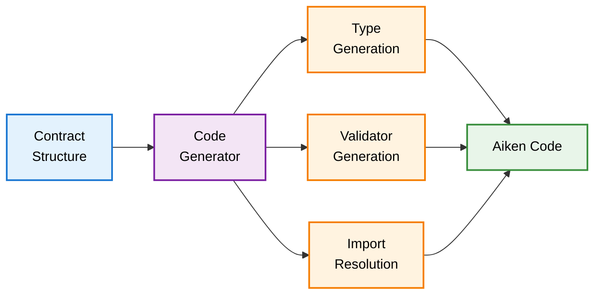

# @uplc/codegen

Aiken code generation from contract structure.

## What It Does

Generates readable, idiomatic Aiken code from the analyzed contract structure. Maps UPLC builtins to Aiken standard library functions and produces properly typed validator code.

## Architecture



## Input/Output

- **Input**: ContractStructure from `@uplc/patterns`
  - Script purpose
  - Datum/redeemer structure
  - Validation checks
  - Context usage

- **Output**: Aiken source code
  - Type definitions (Datum, Action/Redeemer)
  - Validator function with correct signature
  - Import statements
  - Idiomatic Aiken syntax

## Usage

```typescript
import { parseUplc } from '@uplc/parser';
import { analyzeContract } from '@uplc/patterns';
import { generate } from '@uplc/codegen';

const ast = parseUplc(uplcText);
const structure = analyzeContract(ast);
const aikenCode = generate(structure);

console.log(aikenCode);
// Output:
// use aiken/transaction.{Transaction}
//
// type Datum {
//   owner: ByteArray,
//   deadline: Int,
// }
//
// type Action {
//   Cancel
//   Claim
// }
//
// validator my_validator {
//   spend(datum: Option<Datum>, redeemer: Action, ctx: Transaction) {
//     // ... generated validation logic
//   }
// }
```

## API Reference

### `generate(structure: ContractStructure): string`

Generates Aiken code from contract structure.

**Returns**: Valid Aiken source code as a string

## Features

- **Smart Imports**: Only imports used modules (transaction, list, bytearray, etc.)
- **Type Generation**: Creates proper Aiken types for Datum and Redeemer
- **Builtin Mapping**: Maps UPLC builtins to Aiken stdlib functions:
  - `equalsInteger` → `==`
  - `lessThanInteger` → `<`
  - `appendByteString` → `bytearray.concat()`
  - `verifyEd25519Signature` → `crypto.verify_ed25519_signature()`
  - And many more...
- **Idiomatic Syntax**: Uses Aiken conventions (snake_case, expect, when)
- **Generic Fallback**: Falls back to generic variable names when specific detection fails

## Code Generation Rules

1. **Validator Signatures**:
   - Spend: `spend(datum: Option<Datum>, redeemer: Action, ctx: Transaction)`
   - Mint: `mint(redeemer: Action, ctx: Transaction)`
   - Certify: `certify(redeemer: Action, ctx: Transaction)`
   - Reward: `reward(redeemer: Action, ctx: Transaction)`

2. **Type Naming**:
   - Datum type: `Datum` (always)
   - Redeemer type: `Action` (for spend), `MintAction`, `CertifyAction`, `RewardAction`

3. **Variable Naming**:
   - Datum fields: Inferred from usage or generic (field_0, field_1, etc.)
   - Redeemer variants: Inferred from pattern or generic (Variant0, Variant1, etc.)

4. **Comments**:
   - Adds inline comments for validation checks
   - Notes when fields are inferred vs detected

## Development

```bash
pnpm install
pnpm test
```

## Examples

See the test suite for examples of generated code for common contract patterns:
- Multi-signature validators
- Time-locked contracts
- NFT validators
- DEX pool validators
