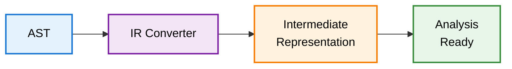

# @uplc/ir

Intermediate representation for UPLC analysis.

## What It Does

Transforms the raw AST into a higher-level intermediate representation (IR) that's easier to analyze and reason about.

## Architecture



## Input/Output

- **Input**: AST from `@uplc/parser`
  - Raw UPLC syntax tree
  - Low-level constructs

- **Output**: Intermediate Representation
  - Higher-level abstractions
  - Simplified control flow
  - Normalized patterns

## Usage

```typescript
import { parseUplc } from '@uplc/parser';
import { toIR } from '@uplc/ir';

const ast = parseUplc(uplcText);
const ir = toIR(ast);

// ir contains normalized representation ready for analysis
```

## API Reference

### `toIR(ast: UplcTerm): IR`

Converts AST to intermediate representation.

### IR Node Types

The IR simplifies the AST by:
- Collapsing force/delay chains
- Normalizing builtin applications
- Identifying common patterns (conditionals, matches, etc.)
- Tracking variable bindings and scopes

## Features

- **Pattern Normalization**: Converts common AST patterns to semantic constructs
- **Control Flow**: Identifies conditionals, loops, and match expressions
- **Data Flow**: Tracks variable bindings and usage
- **Builtin Simplification**: Groups builtin applications into logical operations

## Development

```bash
pnpm install
pnpm test
```
