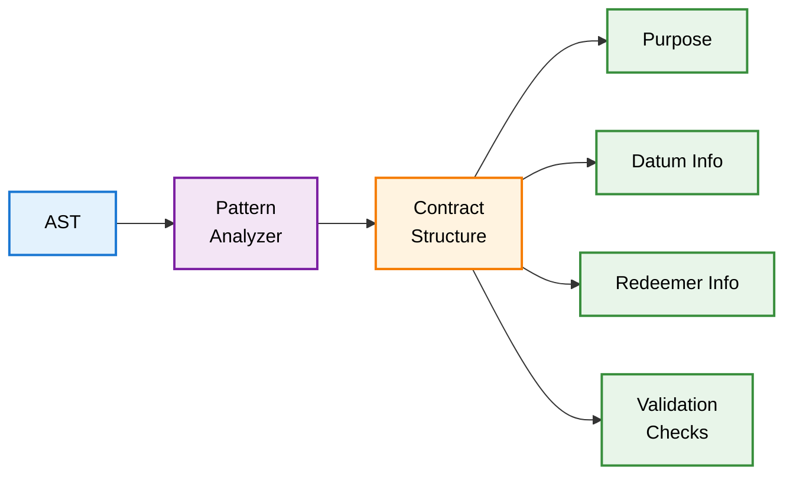

# @uplc/patterns

Contract pattern recognition for Cardano Plutus validators.

## What It Does

Analyzes the UPLC AST to extract high-level contract structure: purpose (spend/mint/certify/reward), datum/redeemer types, validation checks, and script context usage.

## Architecture



## Input/Output

- **Input**: AST from `@uplc/parser`
  - Raw UPLC syntax tree
  - Lambda structure
  - Builtin applications

- **Output**: Contract Structure
  - Script purpose (spend, mint, certify, reward)
  - Datum structure (fields, types)
  - Redeemer structure (variants, fields)
  - Validation checks
  - Script context usage

## Usage

```typescript
import { parseUplc } from '@uplc/parser';
import { analyzeContract } from '@uplc/patterns';

const ast = parseUplc(uplcText);
const structure = analyzeContract(ast);

console.log(structure.type);           // 'spend' | 'mint' | 'certify' | 'reward'
console.log(structure.params);         // ['datum', 'redeemer', 'context']
console.log(structure.datum.fields);   // Detected datum fields
console.log(structure.redeemer.variants); // Detected redeemer variants
console.log(structure.checks);         // Validation logic
```

## API Reference

### `analyzeContract(ast: UplcTerm): ContractStructure`

Analyzes the AST and extracts contract structure.

### ContractStructure

```typescript
interface ContractStructure {
  type: 'spend' | 'mint' | 'certify' | 'reward' | 'unknown';
  params: string[];
  datum: DatumInfo;
  redeemer: RedeemerInfo;
  checks: ValidationCheck[];
  contextUsage: ContextUsage;
  rawBody: UplcTerm; // Original AST body
}

interface DatumInfo {
  isUsed: boolean;
  fields: Field[];
  isOptional: boolean;
}

interface RedeemerInfo {
  variants: Variant[];
}

interface ValidationCheck {
  type: string;
  description: string;
  builtins: string[];
}
```

## Features

- **Purpose Detection**: Identifies spend/mint/certify/reward validators by parameter count and structure
- **Datum Analysis**: Extracts datum fields and types from pattern matching
- **Redeemer Analysis**: Detects redeemer variants from case/when expressions
- **Validation Checks**: Identifies signature checks, deadline checks, value checks, etc.
- **Context Usage**: Tracks which parts of script context are accessed

## Pattern Recognition

The analyzer detects common Cardano validation patterns:

- **Signature Verification**: `verifyEd25519Signature`, `verifySchnorrSecp256k1Signature`
- **Time Checks**: Comparisons with `validity_range.lower_bound` / `upper_bound`
- **Value Checks**: `lovelaceLockedBy`, token checks
- **Datum Continuity**: Output datum matching
- **Reference Input**: Usage of reference inputs

## Development

```bash
pnpm install
pnpm test
```
